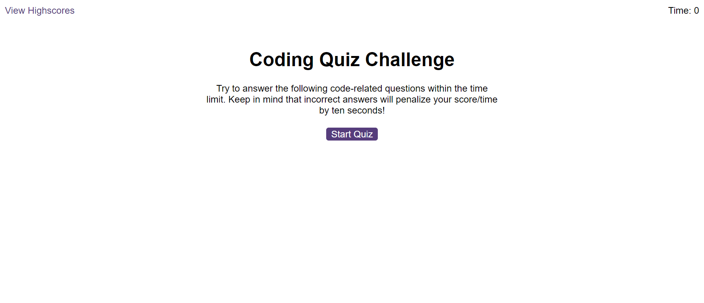

# Code Quiz

A Quiz appllication with a timer that stores your scores in local storage.

[**Deployed Project**](https://sebzg.github.io/Code-Quiz/index.html)

##

### Usage

- Click "Start Quiz" button to start quiz.
- 10 random questions are generated from a list.
- Score is based on time left.
- If answered wrong, time is deducted.
- Quiz ends if time reaches 0 or 10 questions are answered.
- At end of Quiz you may add initials and click "submit" to store scores in local storage.
- Scores may be cleared/reset at anytime on highscores page.

##

### Resources

- [**W3 School**](https://www.w3schools.com/)
- [**MDN Web Docs**](https://developer.mozilla.org/)

##

### Start

##

### Quiz

##

### Submit

##

### Highscores

